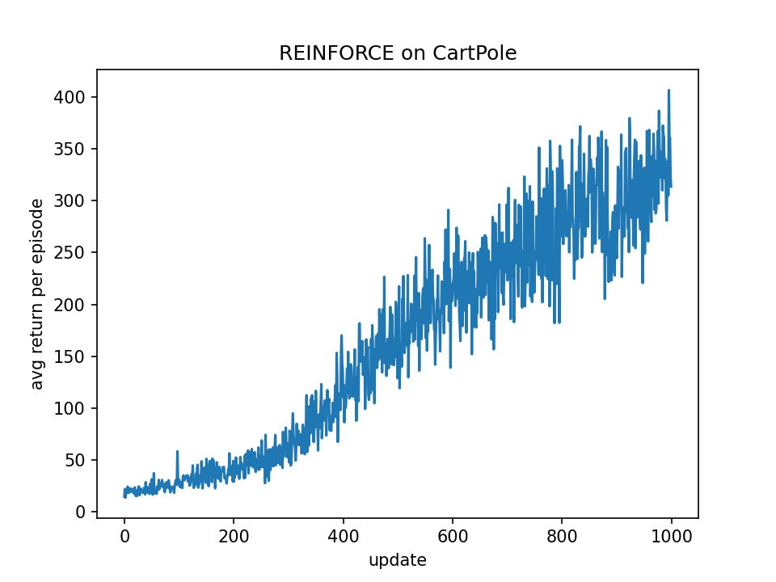

# [REINFORCE on CartPole](https://github.com/whoiskiwi/REINFORCE-CartPole)

A clean, from-scratch implementation of the vanilla **REINFORCE** (Monte Carlo policy gradient) algorithm, solving the [CartPole-v1](https://gymnasium.farama.org/environments/classic_control/cart_pole/) environment using PyTorch and Gymnasium.

## Background

### CartPole-v1 Environment

CartPole is a classic reinforcement learning control problem. A pole is attached to a cart via an unactuated joint, and the cart can move along a frictionless horizontal track. The goal is to keep the pole upright by applying forces to the left or right.

- **Observation space**: 4-dimensional continuous vector `[cart_position, cart_velocity, pole_angle, pole_angular_velocity]`
- **Action space**: Discrete, 2 actions — `0` (push left) or `1` (push right)
- **Reward**: +1 for every timestep the pole remains upright
- **Termination**: Pole angle exceeds ±12°, cart position exceeds ±2.4, or episode length reaches 500
- **Solved criterion**: Average return ≥ 475 over 100 consecutive episodes

### REINFORCE Algorithm

REINFORCE (Williams, 1992) is the most fundamental policy gradient algorithm. It is a Monte Carlo method whose core idea is: **update the policy parameters in the direction that increases the probability of high-return trajectories**.

#### Mathematical Derivation

The objective is to maximize the expected return:

```
J(θ) = E_{τ~π_θ} [R(τ)]
```

where τ = (s_0, a_0, r_0, s_1, a_1, r_1, ...) is a complete trajectory.

By the **Policy Gradient Theorem**, the gradient of the objective is:

```
∇_θ J(θ) = E_{τ~π_θ} [ Σ_t ∇_θ log π_θ(a_t | s_t) · G_t ]
```

where **G_t** is the discounted return-to-go starting from timestep t:

```
G_t = Σ_{k=t}^{T-1} γ^{k-t} · r_k
```

#### Implementation Details (Batch REINFORCE, No Baseline)

```
Repeat:
  1. Collect N trajectories τ_i ~ π_θ
  2. For each trajectory at each timestep, compute G_t via backward recursion:
       G_t = r_t + γ · G_{t+1},  where G_T = 0
  3. Estimate the policy gradient:
       ĝ = (1/N) · Σ_i Σ_t ∇_θ log π_θ(a_t^(i) | s_t^(i)) · G_t^(i)
  4. Gradient ascent update:
       θ ← θ + α · ĝ
```

In PyTorch, since optimizers perform gradient **descent** by default, we construct a surrogate loss:

```
L(θ) = (1/N) · Σ_i Σ_t [ -log π_θ(a_t | s_t) · G_t ]
```

Performing gradient descent on L(θ) is equivalent to gradient ascent on J(θ).

## Project Structure

```
.
├── reinforce_trainer_batch.py   # Main training script (policy network + batch trainer + training loop)
├── plot_curve.py                # Utility to re-plot training curve from log file
├── train_log.txt                # Training log (full record of 1000 updates)
├── train_curve.png              # Training curve plot
└── RL_CartPole.pptx             # Presentation slides
```

## Code Structure

### Policy Network (`Policy`)

A two-layer fully connected neural network that outputs a probability distribution over actions:

```
s_t ∈ R^4  →  [Linear(4, 128) + ReLU]  →  [Linear(128, 2) + Softmax]  →  π_θ(·|s_t) ∈ Δ^2
```

- **Input**: 4-dimensional state vector
- **Hidden layer**: 128 neurons with ReLU activation
- **Output**: 2-dimensional probability vector (one probability per action), normalized by Softmax

### BatchTrainer

Performs a single policy update:

1. Receives N collected trajectories, each containing a sequence of `(log π_θ(a_t|s_t), r_t)` pairs
2. Computes return-to-go `G_t` for each trajectory via backward recursion
3. Constructs surrogate loss `L(θ) = (1/N) Σ_i Σ_t [-log π_θ(a_t|s_t) · G_t]`
4. Backpropagation + Adam optimizer parameter update

### Training Loop (`main`)

```
for step in range(1000):
    episodes = []
    for i in range(10):                      # Collect 10 trajectories
        Run a complete episode:
            s_t → π_θ(·|s_t) → sample a_t → env returns (s_{t+1}, r_t)
            Store (log π_θ(a_t|s_t), r_t)
    trainer.step(episodes)                    # One policy gradient update
    Log and print average return
```

## Hyperparameters

| Parameter | Symbol | Value | Description |
|-----------|--------|-------|-------------|
| Learning rate | α | 2e-4 | Adam optimizer step size |
| Batch size | N | 10 | Number of trajectories per update |
| Discount factor | γ | 0.98 | Decay coefficient for future rewards |
| Hidden dimension | — | 128 | Number of neurons in the hidden layer |
| Total updates | — | 1000 | Total number of policy gradient updates |

## Training Result

After 1000 policy updates (10,000 episodes in total), the agent successfully learns to balance the pole:



- **Early phase** (update 0–100): Average return ~15–30; the agent acts nearly randomly
- **Learning phase** (update 100–500): Return steadily increases from ~30 to ~200
- **Convergence phase** (update 500–1000): Return stabilizes in the 200–400 range, peaking at ~406

Because REINFORCE without a baseline is a pure Monte Carlo method, the gradient estimate has high variance, which causes noticeable fluctuations in the training curve. Introducing a baseline (e.g., a state value function) would significantly reduce this variance.

## Requirements

- Python 3.8+
- PyTorch
- Gymnasium
- Matplotlib

```bash
pip install torch gymnasium matplotlib
```

## Usage

Train the agent (automatically saves the training curve to `train_curve.png`):

```bash
python reinforce_trainer_batch.py
```

Re-plot the training curve from an existing log file:

```bash
python plot_curve.py
```

Redirect training logs to a file:

```bash
python reinforce_trainer_batch.py | tee train_log.txt
```

## Possible Improvements

- **Add a Baseline**: Use a state value function V(s) as a baseline to reduce gradient estimate variance → REINFORCE with baseline
- **Actor-Critic**: Replace Monte Carlo returns with TD estimates to further reduce variance
- **Entropy Regularization**: Add a policy entropy bonus to the loss function to encourage exploration
- **Return Normalization**: Standardize G_t (subtract mean, divide by standard deviation) to stabilize training

## References

- Williams, R.J. (1992). *Simple Statistical Gradient-Following Algorithms for Connectionist Reinforcement Learning*. Machine Learning, 8, 229-256.
- Sutton, R.S. & Barto, A.G. (2018). *Reinforcement Learning: An Introduction* (2nd ed.). Chapter 13: Policy Gradient Methods.
- [Gymnasium CartPole-v1 Documentation](https://gymnasium.farama.org/environments/classic_control/cart_pole/)
